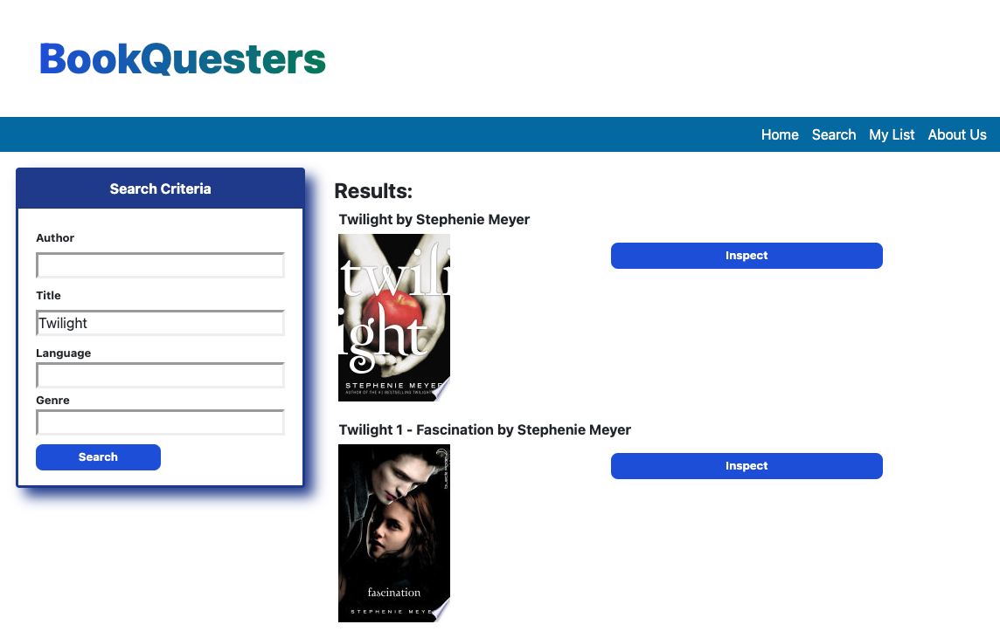
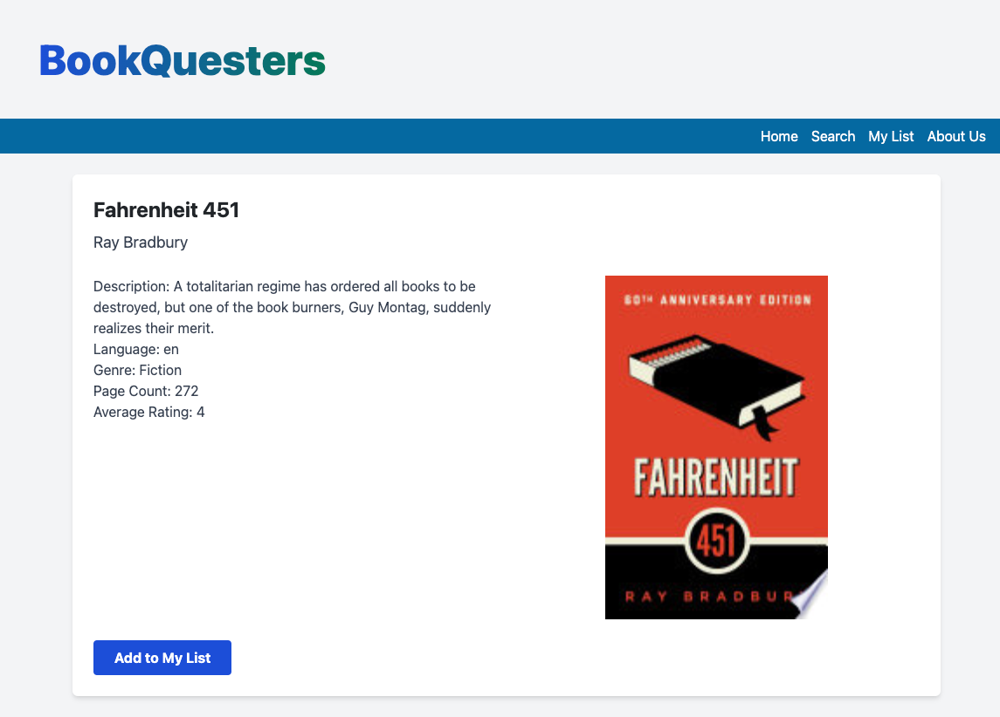
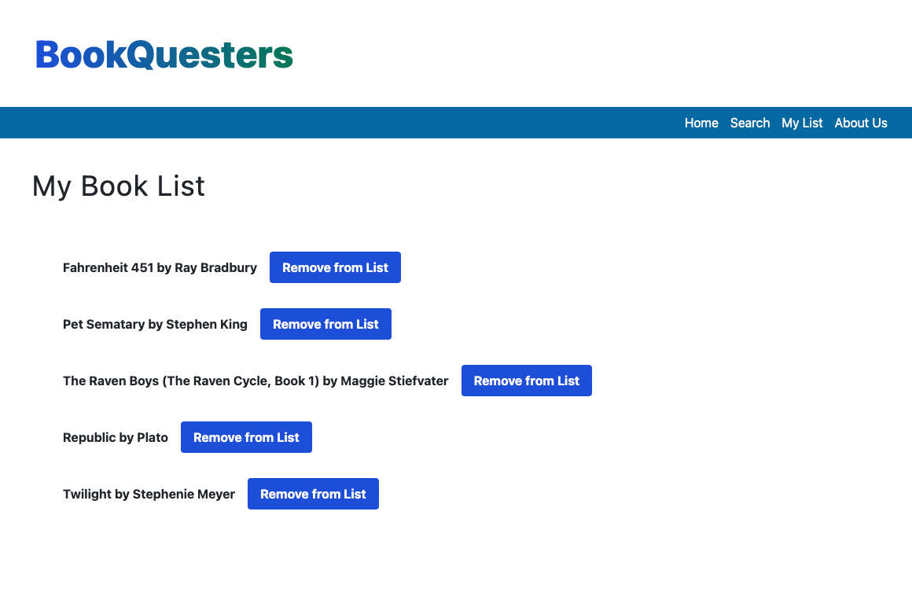

# BookQuesters

## Description

BookQuesters is an online platform that offers the best of both worlds for book lovers. Whether you want to search for a specific book or let the internet decide, BookQuesters has a solution for you! 

With a simple click, discover a world of surprises through our "Random Book" feature, which introduces you to books from various genres, authors, and cultures. Immerse yourself in captivating stories you might have never stumbled upon otherwise.

BookQuesters also empowers you to take control of your reading journey. 
Easily search and explore a vast library of books using our user-friendly search function, where you can find your favorite authors, titles, and genres. 

The site also has a convenient "Add to list" feature, allowing you to create a personalized collection of books you'd like to explore when the time is right. 

Our site was created with familiar readers and new readers in mind! We hope that BookQuesters can be an application which engourages those who are unsure where to start on their reading journey to begin with an easy-to-use interface, as well as easily assist any voracious bookworm. 

On the developer-side this project challenged our knowledge of JavaScript and the usage of Local Storage. Generating the functionality of this website required learning new ways to utilize Javascript functions and their integration with Third-Party APIs. 

Fetching information from an API required use of JSON and traversing the objects via dot notation to be able to display the appropriate information on the website. Getting familiar with template literals, string manipulation, fetch and then functions for API use, and using for loops and if, else statements inside functions were necessary techniques to be able to achieve the functionality that we desired to provide a seamless user experience. 

## Installation

To run the code, clone the project directories from [the repository](https://github.com/BretKruse/team-3-project) and open the HTML and JavaScript files in preferred code editor. 

The HTML files can be viewed to examine the basic display elements and how they are organized on the webpage. The following is a list of the HTML files and their respective uses:

**index.html:** The index.html file serves as the "home page" of the website with links to the search page, the about page and a button to generate a random list of books.

**about.html:** This page describes th purpose of the website and provides a brief explanation of its functionality to the user.

**search.html:** This page contains the form used to search for specific books and displays the results.

**info.html:** Displays more specific informaton about a book that was clicked on from the search results on the search page.

**list.html:** Displays the user's personal book list. Each list item has a button to also remove it from the list. This list is maintined in local storage.

The Javascript file can be viewed to inspect the complex interactivity of the webpage. Many of the JavaScript files also create and display HTML elements either on page load or after a button is clicked. The following is a list of the JavaScript files and the functionality they provide with their correcponding HTML file:

**script.js:** This JavaScript file corresponds to the index.html file and serves to generate the list of ten random books fetched from the Open Library API.

**search.js:** This JavaScript file corresponds to the search.html file. This file searches for and displays the list of books that the user searched for using the form. It also provides a link to inspect the book details, linking to the info.html file.

**info.js:** This Javascript file displays more details about the respective book and allows the user to add it to their list.

**list.js:** This JavaScript file displays the user's personal book list fetched from local storage. Users can also remove a book from their list from this page.

## Usage

The home page has buttons to learn more about the site, get started with a book search and generate a list of random books.

The "Random Books" feature can take the pressure of knowing what to look for away and present you with a list of randomly selected books to choose from to add to your list.

Those who already know what they wish to look for can use our "search" feature to search for a book by the Title, Author, genre or language! The results can be inspected to see the book description, language, genre, page count and average rating. On this page is also a button to enable users to add the book to their book list.

Clicking the "Add to My List" button will add the selected book to the user's list and take them to their personal list page where thay can view their list and remove books from the list if so desired.

The deployed site can be reached at this link: https://sillytsundere.github.io/team-3-project/

## Credits

### Collaborators
Paige Carroll  
-GitHub: [sillytsundere](https://github.com/sillytsundere) 
Nancy Ramirez  
-GitHub: [nramirez686](https://github.com/nramirez686) 
Eric Villarreal  
-GitHub: [evillarreal18](https://github.com/evillarreal18) 
Ezekiel Dominick Matias  
-GitHub: [zekedomz](https://github.com/zekedomz) 
Bret Kruse  
-GitHub: [BretKruse](https://github.com/BretKruse) 

Two API Libraries were used in this application; 
[Google Books API](https://developers.google.com/books) 
[Open Library API](https://openlibrary.org/developers/api)

## License

MIT License

## Badges

